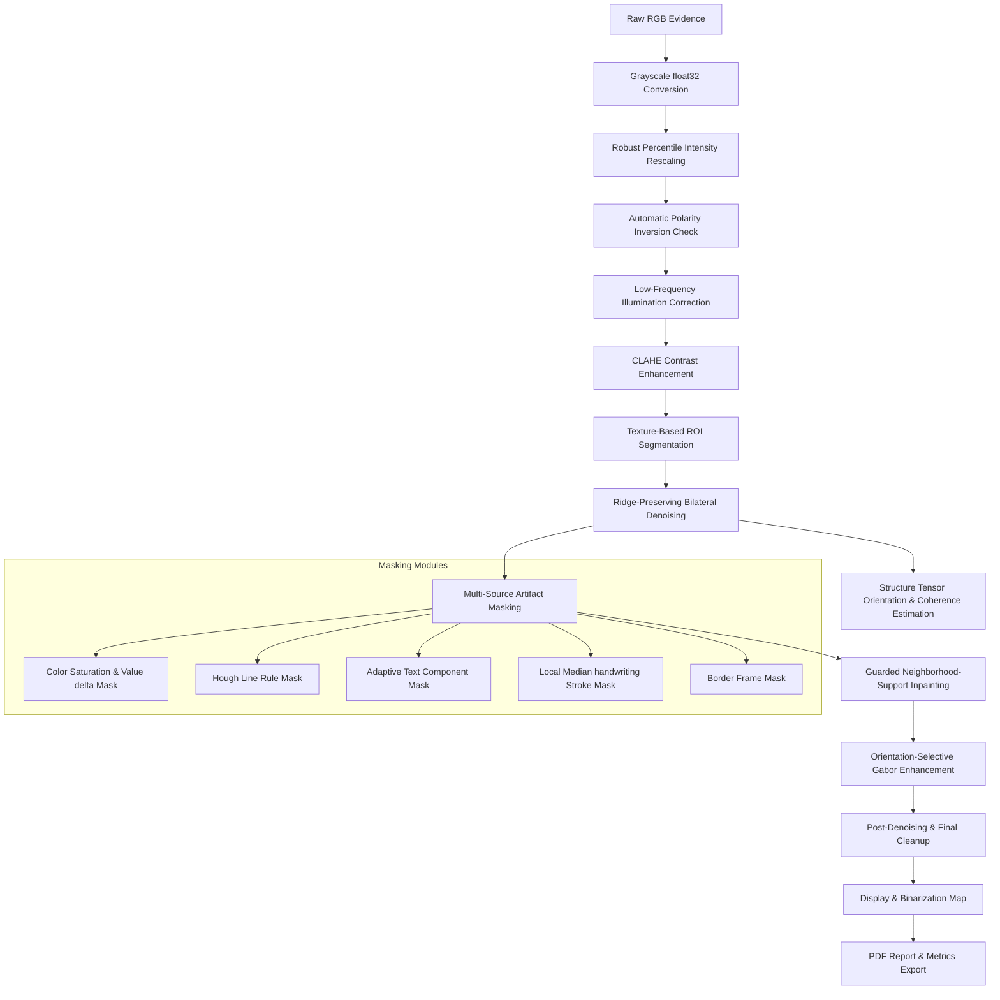

# Forensic Fingerprint Preprocessing & Reconstruction Pipeline

[](LICENSE)
[](https://www.python.org/)
[]()

An industry-grade, scientifically bounded biometrics preprocessing engine and interactive workspace designed to isolate, clean, and reconstruct latent or noisy fingerprint evidence. 

This repository houses a multi-stage image processing pipeline that targets non-ridge artifacts—such as handwritten annotations, pen strokes, ruler markings, scanner crop lines, and scanner noise—while preserving the integrity of the underlying ridge flow.

---

## Technical Architecture & Pipeline Workflow

The processing pipeline is designed to be sequential, deterministic, and verifiable. The flow of data through the system is structured as follows:



---

## Core Algorithmic Components

### 1. Grayscale Normalization & Polarity Correction
- **Intensity Rescaling**: Outlier intensities (e.g. glare, deep shadows) are suppressed by clamping pixels to robust percentile boundaries (default: 1.0% to 99.0%) and stretching the remaining dynamic range to `[0.0, 1.0]`.
- **Polarity Alignment**: Standard forensic analysis requires dark ridges on a light background. Polarity is evaluated dynamically by comparing the outer border median intensity against the inner area median intensity. If a dark-background/light-ridge scan is detected, the image is automatically inverted.

### 2. Illumination Correction & CLAHE
- **Background Flattening**: High-pass filtering is achieved by estimating low-frequency illumination variations using a wide Gaussian kernel ($\sigma = 26$) and subtracting the result from the normalized image.
- **Adaptive Contrast**: Contrast Limited Adaptive Histogram Equalization (CLAHE) is applied using a local grid (default: $8 \times 8$) and a clip limit of $2.0$. This locally boosts ridge contrast while preventing the amplification of high-frequency noise.

### 3. Fingerprint ROI Segmentation
- **Score Calculation**: The Region of Interest (ROI) is segmented by combining texture variance and directional gradient metrics:
  $$\text{Score} = w_v \cdot \sigma_{\text{local}}(I) + w_g \cdot \|\nabla I\|$$
  where $w_v = 0.72$ and $w_g = 0.28$.
- **Boundary Optimization**: The raw score map is binarized using Otsu thresholding, refined morphologically via closing/opening, and bounded with a convex hull to isolate the fingerprint foreground.

### 4. Noise Suppression & Parameter Estimation
- **Bilateral Filtering**: High-frequency sensor noise is eliminated using a bilateral filter ($d=5$, $\sigma_{\text{color}}=35$, $\sigma_{\text{space}}=5$) which preserves the sharp edge boundaries of the ridge contours.
- **Structure Tensor Analysis**: Local ridge angles ($\theta$) and structural coherence ($C$) are estimated using the structure tensor:
  $$J = \begin{bmatrix} 
  \langle I_x^2 \rangle & \langle I_x I_y \rangle \\ 
  \langle I_x I_y \rangle & \langle I_y^2 \rangle 
  \end{bmatrix}$$
  The dominant local orientation is calculated perpendicular to the primary eigenvector of $J$.

### 5. Multi-Source Masking & Guarded Reconstruction
- **Automated Masking**: Artifacts are isolated via specialized modules:
  - **Color**: HSV saturation checks separate non-neutral inks (red/blue pen markings) from neutral gray ridges.
  - **Ruled Lines**: Probabilistic Hough Line Transform finds and masks straight ruled lines.
  - **Strokes & Text**: Adaptive thresholding and local-median deviations segment handwriting and print marks.
- **Guarded Inpainting (Telea Method)**: Interrupted ridges are reconstructed within masked regions. To maintain scientific integrity, inpainting is restricted to regions that meet structural boundaries:
  - Component area $\le 1600\text{ px}^2$, width/height $\le 48\text{ px}$.
  - Surrounding neighborhood support ratio $\ge 55\%$.
  - Gaps exceeding these thresholds remain **blocked** (unaltered) to prevent the system from fabricating non-existent ridge detail.

### 6. Gabor Filter Enhancement
- **Selective Tuning**: A bank of Gabor filters tuned to the average ridge period (default: $9\text{ px}$) and 12 orientation angles is convolved with the image. 
- **Coherence-Guided Blending**: The Gabor-filtered output is blended back into the denoised image exclusively in high-coherence ROI regions, leaving natural low-coherence regions unaltered to prevent false patterns.

---

## Interactive Forensic Console

The system includes a Flask-powered web console (`web_app.py`) providing:
- **Asynchronous Execution Queue**: Long-running image tasks run in background threads, reporting live pipeline progress to the client interface.
- **Granular Stage Visualizations**: Inspect every step of the pipeline, including raw masks, removed regions, and the final output side-by-side with the original.
- **PDF Report Generation**: Automated generation of standardized analysis reports containing case details, computed quality metrics (coherence, Laplacian sharpness, noise residuals), and comparison maps.

---

## Directory Structure

```
.
├── fingerprint_pipeline.py  # Core image processing suite and algorithms
├── web_app.py               # Asynchronous Flask web server and dashboard UI
├── requirements.txt         # Python package dependencies
├── run_ui.ps1               # Quick-launch PowerShell script for web app
├── run_notebook.ps1         # Quick-launch PowerShell script for Jupyter
├── scripts/
│   └── build_notebook.py    # Helper script to compile notebooks
├── notebooks/
│   └── Fingerprint_Forensic_Preprocessing_Reconstruction.ipynb
├── utils/                   # Test assets and images
└── outputs/                 # Output directory for processed cases (git-ignored)
```

---

## Setup & Running Instructions

### Prerequisites
- Python 3.10 or higher
- C++ Compiler (for OpenCV/Scikit-Image dependencies if building from source)

### Installation
1. **Clone the repository**:
   ```bash
   git clone https://github.com/kushalkhadkaa/Biometrics.git
   cd Biometrics
   ```
2. **Initialize virtual environment**:
   ```bash
   python -m venv .venv
   # Windows
   .venv\Scripts\activate
   # macOS/Linux
   source .venv/bin/activate
   ```
3. **Install dependencies**:
   ```bash
   pip install -r requirements.txt
   ```

### Execution
- **Web Interface**:
  Run `./run_ui.ps1` or execute:
  ```bash
  python web_app.py
  ```
  Navigate to `http://127.0.0.1:5000` in your browser.
  
- **Jupyter Workspace**:
  Run `./run_notebook.ps1` or execute:
  ```bash
  jupyter notebook notebooks/Fingerprint_Forensic_Preprocessing_Reconstruction.ipynb
  ```

---

## Version Control Workflow

For developers contributing to this repository, please adhere to the following git pipeline:

1. **Keep Branch Structure Clean**:
   - Primary releases and stable main branch: `main`.
   - Feature development: `feature/your-feature-name`.

2. **Commit Message Format**:
   Standardize commit messages to ensure readability (e.g. `feat: add adaptive stroke masking`, `fix: correct structure tensor boundary scale`).

3. **Ignore Generated Artifacts**:
   The `.gitignore` is pre-configured. Never check in:
   - Python caches (`__pycache__/`)
   - Virtual environments (`.venv/`)
   - Processing directories (`outputs/`, `outputs/web/`)
