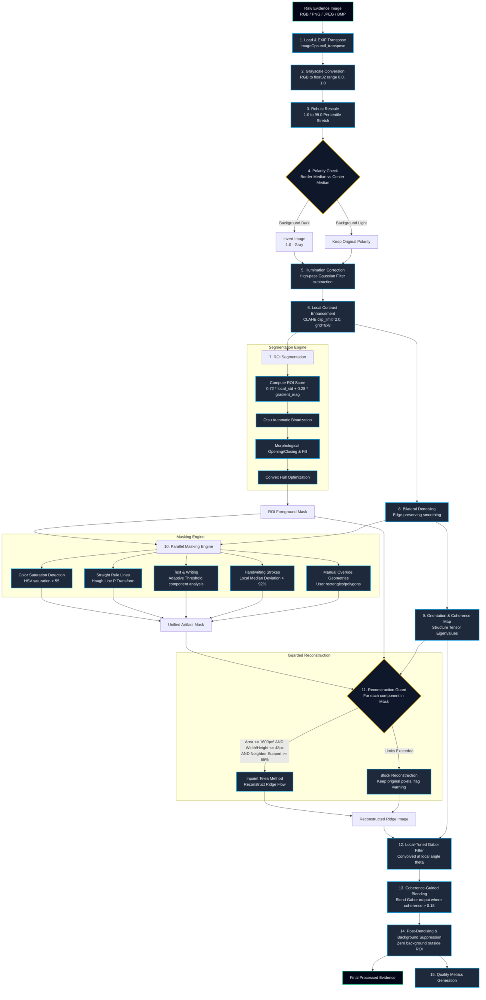

# Forensic-Fingerprint-Enhancement-and-Reconstruction: Latent Preprocessing Pipeline

Forensic-Fingerprint-Enhancement-and-Reconstruction is an industry-grade, scientifically bounded image processing suite and interactive workspace designed to isolate, clean, and reconstruct latent or noisy fingerprint evidence. 

By employing deterministic computer vision algorithms, the pipeline removes non-ridge artifacts—such as handwritten annotations, pen strokes, ruler markings, scanner crop lines, and scanner noise—while strictly preserving and validating the integrity of the underlying ridge flow.

---

## Technical Architecture & Processing Pipeline

The following flowchart details the multi-stage computational graph. The pipeline is structured to ensure that every operation is verifiable, mathematically bounded, and auditable.



---

## Core Algorithmic Engineering

### 1. Robust Gray Normalization & Polarity Check
- **Robust Stretch**: Outliers (dust, scanner glare) are suppressed by calculating:
  $$I_{\text{out}} = \frac{I - I_{p_{\text{low}}}}{I_{p_{\text{high}}} - I_{p_{\text{low}}}}$$
  bounded within `[0.0, 1.0]`, where default percentiles are $1.0\%$ and $99.0\%$.
- **Polarity Inversion**: Automatic orientation check ensures dark ridges are represented on a light background. The border region median $M_b$ is compared to the center median $M_c$:
  $$\text{Invert} = \begin{cases} \text{True} & \text{if } M_b < 0.42 \text{ and } M_c > M_b + 0.08 \\ \text{False} & \text{otherwise} \end{cases}$$

### 2. Illumination Correction & CLAHE
- **Illumination Correction**: Low-frequency background variations are modeled via a Gaussian blur kernel with standard deviation $\sigma = 26.0$. Subtracting this low-frequency baseline flattens uneven scans:
  $$I_{\text{flat}} = I - \text{Gaussian}(I, \sigma) + \text{median}(\text{Gaussian}(I, \sigma))$$
- **Local Contrast Stretching**: Contrast Limited Adaptive Histogram Equalization (CLAHE) is run on the flattened image using a grid size of $8 \times 8$ and clip limit of $2.0$. This maps local variations without introducing boundary halos.

### 3. Fingerprint ROI Segmentation
- **Textural Strength Calculation**: Fingerprint ridges possess high gradients and high standard deviation compared to blank paper. The segmentation score map is computed as:
  $$\text{Score} = 0.72 \cdot \sigma_{\text{local}}(I) + 0.28 \cdot \|\nabla I_{\text{Sobel}}\|$$
  This score map is thresholded via Otsu's method.
- **Morphological Closing**: The binary map is morphologically closed using a disk structuring element of radius $9$ to fill gaps, followed by a morphological opening of radius $3$ to remove speckle noise. Finally, a convex hull boundary is constructed.

### 4. Structure Tensor Angle Estimation
- **Gradient Computation**: Gradients $I_x, I_y$ are computed using Sobel operators on a smoothed input ($\sigma=1.0$).
- **Structure Tensor Construction**: The symmetric tensor $J$ is smoothed using a integration Gaussian window ($\sigma_{\text{integration}} = 5.0$):
  $$J = \begin{bmatrix} \langle I_x^2 \rangle & \langle I_x I_y \rangle \\ \langle I_x I_y \rangle & \langle I_y^2 \rangle \end{bmatrix}$$
- **Orientation & Coherence**: The ridge orientation angle $\theta$ is perpendicular to the primary gradient orientation:
  $$\theta = \frac{1}{2} \arctan2\left(2\langle I_x I_y \rangle, \langle I_x^2 \rangle - \langle I_y^2 \rangle\right) + \frac{\pi}{2}$$
  Coherence $C$ is computed to represent the anisotropy of the local structure:
  $$C = \frac{\sqrt{(\langle I_x^2 \rangle - \langle I_y^2 \rangle)^2 + 4\langle I_x I_y \rangle^2}}{\langle I_x^2 \rangle + \langle I_y^2 \rangle + \epsilon}$$

### 5. Multi-Source Masking & Guarded Reconstruction
- **Ink Annotation Masking**: Standard gray ridges are neutral. Non-neutral writing inks are extracted by verifying that the HSV Saturation channel is $>55$ and the Absolute Value difference from the gray representation is $>30$.
- **Straight Ruled Line Masking**: Ruling lines from notebook paper are isolated by detecting linear edges via Canny ($t_1=60, t_2=160$) and Hough Line Transform mapping. Lines longer than $34\%$ of the image dimension are masked.
- **Adaptive handwriting Extraction**: Thick dark ink strokes are segmented by comparing the smoothed image with a large median filter window ($23 \times 23$). Regions where local median subtraction exceeds the $92\text{nd}$ percentile are masked.
- **Guarded Inpainting**: When artifacts intersect the fingerprint, they are replaced. To protect scientific validity and prevent the fabrication of ridge structures:
  $$\text{Inpaint Allowed} = \begin{cases} \text{True} & \text{if } A_{\text{component}} \le 1600 \text{ px}^2 \text{ and } \text{Support Ratio} \ge 55\% \\ \text{False} & \text{otherwise} \end{cases}$$
  The support ratio evaluates the fraction of valid, clean fingerprint ridges in the surrounding neighborhood. Exceeded components are blocked (unpainted) and flagged.

### 6. Gabor Filter Enhancement
- **Selective Directional Convolution**: Convolves the image with Gabor filter kernels tuned to the ridge period ($9.0\text{ px}$) and 12 distinct angular directions.
- **Coherence Mask Blending**: Gabor outputs are blended into the image only where coherence $C > 0.18$ using a blend factor of $0.32$ to prevent introducing structure in noisy background areas.

---

## Workspace Layout

```
.
├── fingerprint_pipeline.py  # Core algorithms and image processing logic
├── web_app.py               # Asynchronous Flask server and glassmorphic UI
├── requirements.txt         # Package dependencies
├── run_ui.ps1               # PowerShell launcher for the web console
├── run_notebook.ps1         # PowerShell launcher for Jupyter
├── scripts/
│   └── build_notebook.py    # Utility script to compile notebooks
├── notebooks/
│   └── Fingerprint_Forensic_Preprocessing_Reconstruction.ipynb
├── utils/                   # Test datasets and sample images
└── outputs/                 # Output directory for processed cases (git-ignored)
```

---

## Git Workflow Guide for Contributors

To maintain a clean, stable history, follow this workflow:

### 1. Main Branch Policy
- The `main` branch represents fully verified, build-passing, and production-tested releases. 
- Direct pushes to `main` are restricted. All contributions must arrive via Pull Requests.

### 2. Feature Development
Create a descriptively named branch for your work:
```bash
git checkout -b feature/adaptive-denoising-optimization
```

### 3. Clean Commits & Semantic Formatting
Structure your commit messages using semantic prefixes to help automated change tracking:
- `feat:` for new capabilities (e.g. `feat: add adaptive saturation thresholding`)
- `fix:` for bugs (e.g. `fix: resolve structure tensor boundary scale check`)
- `docs:` for documentation (e.g. `docs: update math equations in README`)
- `refactor:` for code cleanups that do not change logic.

### 4. Syncing & Merging
To prevent merge conflict commits, rebase your feature branch on `main` before merging:
```bash
git checkout main
git pull origin main
git checkout feature/your-feature
git rebase main
```

### 5. Pushing & Authentication
If pushing from the terminal for the first time, authenticate via the HTTPS URL:
```bash
git push -u origin feature/your-feature
```
This triggers the Git Credential Manager GUI to secure your session.

---

## Installation & Setup

1. **Clone the repository**:
   ```bash
   git clone https://github.com/kushalkhadkaa/Biometrics.git
   cd Biometrics
   ```
2. **Setup virtual environment**:
   ```bash
   python -m venv .venv
   # Windows
   .venv\Scripts\activate
   # macOS/Linux
   source .venv/bin/activate
   ```
3. **Install standard dependencies**:
   ```bash
   pip install -r requirements.txt
   ```
