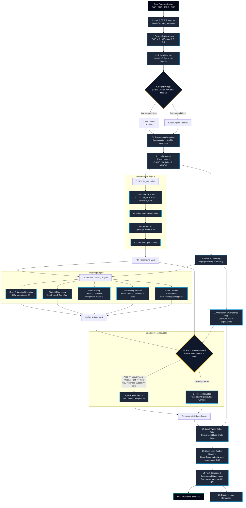

# Fingerprint-Image-Enhancement-and-Reconstruction: Latent Preprocessing Pipeline

Fingerprint-Image-Enhancement-and-Reconstruction is an industry-grade, scientifically bounded image processing suite and interactive workspace designed to isolate, clean, and reconstruct latent or noisy fingerprint evidence. 

By employing deterministic computer vision algorithms, the pipeline removes non-ridge artifacts—such as handwritten annotations, pen strokes, ruler markings, scanner crop lines, and scanner noise—while strictly preserving and validating the integrity of the underlying ridge flow.

---

## Technical Architecture & Processing Pipeline

The following flowchart details the multi-stage computational graph. The pipeline is structured to ensure that every operation is verifiable, mathematically bounded, and auditable.



---

## Core Algorithmic Engineering & Mathematical Formulations

This section provides the rigorous mathematical definitions, algorithmic execution details, and configuration settings for each processing stage in the pipeline.

### 1. Robust Gray Normalization & Polarity Check
- **Robust Percentile Contrast Rescaling**: To prevent extreme pixel values (such as scanner clip marks, dust, or sensor noise) from compressing the dynamic range of fingerprint ridges, we calculate the low and high intensity percentiles $I_{p_{\text{low}}}$ (default 1.0%) and $I_{p_{\text{high}}}$ (default 99.0%). The rescaled floating-point intensity $I_{\text{out}}(x,y)$ is defined as:
  $$I_{\text{out}}(x,y) = \text{clamp}\left( \frac{I(x,y) - I_{p_{\text{low}}}}{I_{p_{\text{high}}} - I_{p_{\text{low}}}}, \; 0.0, \; 1.0 \right)$$
  where $\text{clamp}(v, a, b) = \max(a, \min(v, b))$.
- **Automatic Polarity Inversion**: Latent fingerprints are standardly represented as dark ridges on a light background. To automatically detect and invert reverse-polarity scans (white ridges on black backing card), we compute the median intensity of the outer border boundary region $M_b$ (within a margin width of $w_m = \min(w, h)/16$) and compare it with the median of the central area $M_c$:
  $$I_{\text{polar}}(x,y) = \begin{cases} 
  1.0 - I_{\text{out}}(x,y) & \text{if } M_b < 0.42 \text{ and } M_c > M_b + 0.08 \\ 
  I_{\text{out}}(x,y) & \text{otherwise} 
  \end{cases}$$

### 2. Illumination Correction & CLAHE
- **Illumination Correction via Background Subtraction**: uneven illumination is corrected by modeling the low-frequency background luminance via a large Gaussian blur kernel $G_{\sigma}$ with standard deviation $\sigma = 26.0$. Subtracting this low-frequency baseline flattens the background:
  $$I_{\text{flat}}(x,y) = I_{\text{polar}}(x,y) - \left( I_{\text{polar}} * G_{\sigma} \right)(x,y) + \text{median}\left( I_{\text{polar}} * G_{\sigma} \right)$$
  where $*$ denotes the 2D spatial convolution operator.
- **Contrast Limited Adaptive Histogram Equalization (CLAHE)**: To highlight local ridge detail without amplifying high-frequency noise, the image is divided into $M \times N$ local tiles (default $8 \times 8$). For each tile, the local histogram $H(k)$ is computed. Values above a clip limit threshold $\beta$ are redistributed uniformly across all bins before mapping via the cumulative distribution function (CDF):
  $$\beta = \alpha \cdot \frac{N_x \cdot N_y}{L}$$
  where $N_x, N_y$ are the tile dimensions, $L$ is the number of gray levels (256), and $\alpha$ is the clip factor (default 2.0). Inter-tile boundary artifacts are suppressed using bilinear interpolation.

### 3. Texture-Based Fingerprint ROI Segmentation
- **Texture-Gradient Composite Score**: Fingerprint ridges are characterized by structured contrast and directional edges. The foreground score map $S(x,y)$ combines local standard deviation (representing texture variance) and gradient magnitude:
  $$S(x,y) = w_v \cdot \sigma_{\text{local}}(x,y) + w_g \cdot \sqrt{I_x(x,y)^2 + I_y(x,y)^2}$$
  where $w_v = 0.72$, $w_g = 0.28$, and the local variance is computed over a sliding block $W$ of size $23 \times 23$:
  $$\sigma_{\text{local}}(x,y) = \sqrt{\frac{1}{|W|} \sum_{(u,v) \in W} \left( I(u,v) - \mu(x,y) \right)^2}$$
  $I_x$ and $I_y$ are estimated using Sobel kernels.
- **Morphological Refining & Convex Hull**: The score map is binarized via Otsu's thresholding. The resulting mask $M_{\text{raw}}$ is refined to establish a smooth contiguous boundary:
  $$M_{\text{segmented}} = \text{ConvexHull}\left( \left( M_{\text{raw}} \bullet S_{\text{disk}(9)} \right) \circ S_{\text{disk}(3)} \right)$$
  where $\bullet$ represents morphological closing, $\circ$ represents morphological opening, and the structuring elements $S$ are disks of specified radii.

### 4. Bilateral Denoising & Structure Tensor Parameter Estimation
- **Edge-Preserving Bilateral Filter**: Denoising is performed using a bilateral filter to smooth sensor and paper grain noise without degrading the high-frequency boundaries of ridge edges:
  $$I_{\text{denoised}}(x,y) = \frac{1}{W_p(x,y)} \sum_{(u,v) \in \Omega} I(u,v) \exp\left( -\frac{(u-x)^2 + (v-y)^2}{2\sigma_d^2} \right) \exp\left( -\frac{(I(u,v)-I(x,y))^2}{2\sigma_r^2} \right)$$
  where $\Omega$ is the neighborhood window (diameter $d=5$), $\sigma_d = 5.0$ (spatial variance), $\sigma_r = 35.0$ (range color variance), and $W_p$ is the normalization sum.
- **Structure Tensor Construction**: The local orientation field is estimated by computing the symmetric structure tensor $J$ from smoothed gradients $I_x, I_y$:
  $$J(x,y) = \begin{bmatrix} 
  \langle I_x^2 \rangle_w & \langle I_x I_y \rangle_w \\ 
  \langle I_x I_y \rangle_w & \langle I_y^2 \rangle_w 
  \end{bmatrix}$$
  where $\langle \cdot \rangle_w$ denotes local integration averaging convolved with a Gaussian window $G_{\sigma_i}$ ($\sigma_i = 5.0$).
- **Local Orientation & Coherence**: The dominant ridge direction angle $\theta(x,y) \in [0, \pi)$ is perpendicular to the primary gradient eigenvector:
  $$\theta(x,y) = \frac{1}{2} \arctan2\left( 2\langle I_x I_y \rangle_w, \; \langle I_x^2 \rangle_w - \langle I_y^2 \rangle_w \right) + \frac{\pi}{2}$$
  Coherence $C(x,y)$ measures the local structural anisotropy, indicating the alignment strength of the ridges:
  $$C(x,y) = \frac{\sqrt{ \left(\langle I_x^2 \rangle_w - \langle I_y^2 \rangle_w \right)^2 + 4\langle I_x I_y \rangle_w^2 }}{\langle I_x^2 \rangle_w + \langle I_y^2 \rangle_w + \epsilon}$$
  where $\epsilon = 10^{-6}$ prevents division by zero.

### 5. Multi-Source Masking Engine
- **HSV Ink Saturation Masking**: Writing inks (stamps, pens) differ from grayscale ridges in the color saturation space. Pixels are masked if they exceed saturation and gray-deviation thresholds in the HSV space:
  $$M_{\text{color}}(x,y) = \left( S_{\text{HSV}}(x,y) > 55 \right) \land \left( |V_{\text{HSV}}(x,y) - I_{\text{gray}}(x,y)| \cdot 255 > 30 \right)$$
- **Morphological Reconstruction for Border Frame Removal**: Scanner borders and background crop boundaries are isolated using geodesic dilation reconstruction from the image boundary. Given a dark binary mask $M_{\text{dark}}(x,y) = I_{\text{gray}}(x,y) < P_{2.5}(I_{\text{gray}})$ and a marker image $F_0(x,y)$ initialized to $M_{\text{dark}}$ on the image border margins and $0$ elsewhere, the geodesic dilation of size 1 is:
  $$D_{M_{\text{dark}}}^{(1)}(F) = (F \oplus B) \wedge M_{\text{dark}}$$
  This is iterated until convergence to produce the final border mask:
  $$M_{\text{border}} = R_{M_{\text{dark}}}(F_0) = D_{M_{\text{dark}}}^{(\infty)}(F_0)$$
  where $\oplus$ represents binary dilation with a $3 \times 3$ structuring element $B$, and $\wedge$ represents pointwise logical AND.
- **Hough Line Grid Masking**: Straight ruled lines are extracted by mapping Canny edge points to the parametric Hough accumulator space $(\rho, \phi)$:
  $$\rho = x \cos \phi + y \sin \phi$$
  Accumulator bin values exceeding $80$ votes are back-projected to locate line segments. Segments longer than $34\%$ of the image's minimum dimension are masked and dilated by a width of $5\text{ px}$.
- **Adaptive Handwriting Stroke Masking**: Thick handwriting strokes are extracted using a local median filter comparison. Pixels showing a large negative intensity deviation from the local median are masked:
  $$\Delta I(x,y) = \text{median}_{23\times23}\left( I_{\text{base}} \right)(x,y) - I_{\text{base}}(x,y)$$
  $$M_{\text{stroke}}(x,y) = \text{MorphologicalClosing}\left( \Delta I(x,y) > P_{92}(\Delta I), \; S_{\text{disk}(2)} \right)$$
  where $P_{92}$ represents the $92\text{nd}$ percentile threshold computed over the segmented ROI region.
- **Dark Text & Printing Artifact Extraction Rules**: Dark text and printed annotations are extracted using adaptive thresholding with a local Gaussian window (window size $31$, constant offset $-2$). Each connected component $K_c$ in the resulting adaptive threshold mask $M_{\text{adaptive}}$ is evaluated using shape features:
  - **Overlapping Region**: Let $R_{\text{overlap}}(K_c) = \text{mean}(M_{\text{ROI\_dilated}}[K_c])$ where $M_{\text{ROI\_dilated}}$ is the fingerprint ROI dilated by $8$ iterations.
  - **Definitive Artifact Masking**:
    - If `remove_ambiguous_dark_inside_roi` is enabled, the component is masked if:
      - It is outside the ROI ($R_{\text{overlap}} < 0.02$) and exhibits text-like dimensions: $\text{Aspect}(K_c) > 2.7$ or $\text{Extent}(K_c) > 0.38$ or $\text{Area}(K_c) > 220\text{ px}^2$.
      - It is inside the ROI ($R_{\text{overlap}} \ge 0.02$) and resembles a pen stroke:
        - $(\text{Aspect} > 3.0 \land \text{Area} \ge 45 \land \text{Extent} > 0.08)$ OR
        - $(\text{Area} \le 3500 \land \text{Extent} > 0.42 \land \text{Solidity} > 0.38)$ OR
        - $(\text{Area} \le 6500 \land \text{Aspect} > 2.0 \land \text{Extent} > 0.24 \land \text{Solidity} > 0.34)$
    - If `remove_ambiguous_dark_inside_roi` is disabled, the component is only auto-masked if it is outside the ROI ($R_{\text{overlap}} < 0.02$) and text-like.
  - **Manual Review Flagging**:
    - If the component overlaps the ROI ($R_{\text{overlap}} \ge 0.02$) and `remove_ambiguous_dark_inside_roi` is disabled, it is flagged for manual review if it fits the character size profile:
      $$35 \le \text{Area}(K_c) \le 260 \land 0.45 \le \text{Extent}(K_c) \le 0.90 \land \text{Aspect}(K_c) \le 3.2$$

### 6. Guarded Reconstruction & Telea Inpainting
- **Guarded Inpainting Decision Rules**: For each connected component $K_i$ in the cumulative artifact mask $M_{\text{artifact}}$, reconstruction is only permitted if the component is small enough and has sufficient surrounding structure support to prevent the creation of false ridge details:
  $$\text{Reconstruct}(K_i) = \begin{cases} 
  \text{True} & \text{if } \text{Area}(K_i) \le 1600\text{ px}^2 \land \max(\text{Width}(K_i), \text{Height}(K_i)) \le 48\text{ px} \land \text{Support}(K_i) \ge 0.55 \\ 
  \text{False} & \text{otherwise} 
  \end{cases}$$
- **Neighborhood Support Ratio**: The support ratio evaluates the density of valid, clean fingerprint ridges surrounding the artifact component boundary:
  $$\text{Support}(K_i) = \frac{\sum_{(u,v) \in \partial K_i} M_{\text{ROI}}(u,v) \cdot \left( 1 - M_{\text{artifact}}(u,v) \right)}{\sum_{(u,v) \in \partial K_i} 1}$$
  where $\partial K_i$ is a dilated ring (width $6\text{ px}$) around the component boundary.
- **Fast Marching Inpainting (Telea)**: Gaps where reconstruction is allowed are filled using Telea's method. It propagates image values inwards along the normal directions of the boundary interface, solving the Eikonal equation:
  $$\|\nabla T\| = 1$$
  where $T$ represents the time-of-arrival distance field. To inpaint pixel $p$, its intensity is calculated from known neighbors $q \in \Omega_r(p)$ (radius $r=3\text{ px}$):
  $$I(p) = \frac{\sum_{q \in \Omega_r(p)} w(p,q) \cdot \left( I(q) + \nabla I(q) \cdot (p-q) \right)}{\sum_{q \in \Omega_r(p)} w(p,q)}$$
  The weight $w(p,q)$ combines three factors:
  $$w(p,q) = \text{dir}(p,q) \cdot \text{dst}(p,q) \cdot \text{lev}(p,q)$$
  - Directional alignment: $\text{dir}(p,q) = \frac{p-q}{\|p-q\|} \cdot \mathbf{N}(p)$ where $\mathbf{N}(p) = \nabla T(p)$ is the boundary normal.
  - Geometric distance: $\text{dst}(p,q) = \frac{1}{\|p-q\|^2}$.
  - Level set distance: $\text{lev}(p,q) = \frac{1}{1 + |T(p) - T(q)|}$.
  Gaps where reconstruction is blocked remain unaltered in the final output and are flagged with a quality warning.

### 7. Orientation-Selective Gabor Enhancement
- **Anisotropic Gabor Filtering**: The Gabor filter is a linear filter whose impulse response is defined by a harmonic function multiplied by a Gaussian function. The kernel $g(x,y; \theta, \lambda, \sigma, \gamma)$ tuned to orientation $\theta$ and ridge wavelength $\lambda$ is:
  $$g(x,y; \theta, \lambda, \sigma, \gamma) = \exp\left( -\frac{x'^2 + \gamma^2 y'^2}{2\sigma^2} \right) \cos\left( 2\pi\frac{x'}{\lambda} \right)$$
  $$x' = x \cos\theta + y \sin\theta, \quad y' = -x \sin\theta + y \cos\theta$$
  where $\sigma = 4.0$ controls the Gaussian envelope bandwidth, and $\gamma = 0.55$ defines the spatial aspect ratio.
- **Gabor Filter Bank Index Mapping**: To convolve the image with local-tuned Gabor filters efficiently, we construct a discrete bank of $N_{\theta}$ kernels ($N_{\theta} = 16$ or $32$) covering the angular range $[0, \pi)$:
  $$\theta_k = \frac{k \cdot \pi}{N_{\theta}}, \quad k = 0, 1, \dots, N_{\theta}-1$$
  For each pixel $(x,y)$, we select the response from the filter bank matching the local orientation angle $\theta(x,y)$:
  $$k^*(x,y) = \operatorname{argmin}_{k} \left| \theta(x,y) - \theta_k \right| \pmod \pi$$
  $$I_{\text{Gabor}}(x,y) = \left( I * g_{\theta_{k^*}} \right)(x,y)$$
- **Coherence Blending**: To prevent introducing artificial patterns in unstructured regions, Gabor output is blended with the denoised image using the computed local coherence map $C(x,y)$ as a weight in reliable ROI regions:
  $$I_{\text{enhanced}}(x,y) = \begin{cases} 
  (1 - w_b) \cdot I(x,y) + w_b \cdot I_{\text{Gabor}}(x,y) & \text{if } (x,y) \in M_{\text{ROI}} \land C(x,y) > 0.18 \\ 
  I(x,y) & \text{otherwise} 
  \end{cases}$$
  where $w_b = 0.32$ is the maximum blending weight.

### 8. Sauvola Local Adaptive Thresholding (Preview Binarization)
- **Sauvola Binarization Method**: For preview and validation checks, the enhanced gray image is binarized using Sauvola local adaptive thresholding over a window of size $W \times W$ (default $25 \times 25$):
  $$T(x,y) = m(x,y) \cdot \left[ 1 + k \cdot \left( \frac{s(x,y)}{R} - 1 \right) \right]$$
  where:
  - $m(x,y)$ is the local mean value of the window centered at $(x,y)$.
  - $s(x,y)$ is the local standard deviation.
  - $R = 0.5$ is the maximum standard deviation for normalized $[0.0, 1.0]$ images.
  - $k = 0.2$ is a user-controlled parameter specifying the threshold shift.
  The final preview binarized image is defined as:
  $$I_{\text{bin}}(x,y) = \begin{cases} 
  0.0 & \text{if } (x,y) \in M_{\text{ROI}} \land I_{\text{enhanced}}(x,y) < T(x,y) \\ 
  1.0 & \text{otherwise} 
  \end{cases}$$

### 9. Forensic Quality Metrics
- **Contrast (ROI Standard Deviation)**: Measures dynamic range inside the fingerprint region:
  $$\text{Contrast}_{\text{ROI}} = \sqrt{ \frac{1}{|M_{\text{ROI}}|} \sum_{(x,y) \in M_{\text{ROI}}} \left( I(x,y) - \mu_{\text{ROI}} \right)^2 }$$
- **Orientation Coherence**: Evaluates the average structural clarity:
  $$\text{Coherence}_{\text{ROI}} = \frac{1}{|M_{\text{ROI}}|} \sum_{(x,y) \in M_{\text{ROI}}} C(x,y)$$
- **Laplacian Variance (Sharpness)**: Assesses the high-frequency transitions (edge sharpness) of ridges:
  $$\text{Sharpness}_{\text{ROI}} = \text{Var}_{(x,y) \in M_{\text{ROI}}}\left( \Delta I(x,y) \right)$$
  where $\Delta I = \frac{\partial^2 I}{\partial x^2} + \frac{\partial^2 I}{\partial y^2}$ is the discrete Laplacian.
- **Noise Index (MAD of Residual)**: Measures standard noise using the Median Absolute Deviation of the high-frequency residual:
  $$\text{Residual}(x,y) = I_{\text{orig}}(x,y) - \left( I_{\text{orig}} * G_{\sigma=1.0} \right)(x,y)$$
  $$\text{MAD} = \operatorname{median}\left( \left| \text{Residual} - \operatorname{median}(\text{Residual}) \right| \right)$$

---

## Workspace Layout

```
.
├── fingerprint_pipeline.py  # Core algorithms and image processing logic
├── web_app.py               # Asynchronous Flask server and glassmorphic UI
├── requirements.txt         # Package dependencies
├── run_ui.ps1               # PowerShell launcher for the web console
├── run_notebook.ps1         # PowerShell launcher for Jupyter
├── scripts/
│   └── build_notebook.py    # Utility script to compile notebooks
├── notebooks/
│   └── Fingerprint_Forensic_Preprocessing_Reconstruction.ipynb
├── utils/                   # Test datasets and sample images
└── outputs/                 # Output directory for processed cases (git-ignored)
```

---

## Git Workflow Guide for Contributors

To maintain a clean, stable history, follow this workflow:

### 1. Main Branch Policy
- The `main` branch represents fully verified, build-passing, and production-tested releases. 
- Direct pushes to `main` are restricted. All contributions must arrive via Pull Requests.

### 2. Feature Development
Create a descriptively named branch for your work:
```bash
git checkout -b feature/adaptive-denoising-optimization
```

### 3. Clean Commits & Semantic Formatting
Structure your commit messages using semantic prefixes to help automated change tracking:
- `feat:` for new capabilities (e.g. `feat: add adaptive saturation thresholding`)
- `fix:` for bugs (e.g. `fix: resolve structure tensor boundary scale check`)
- `docs:` for documentation (e.g. `docs: update math equations in README`)
- `refactor:` for code cleanups that do not change logic.

### 4. Syncing & Merging
To prevent merge conflict commits, rebase your feature branch on `main` before merging:
```bash
git checkout main
git pull origin main
git checkout feature/your-feature
git rebase main
```

### 5. Pushing & Authentication
If pushing from the terminal for the first time, authenticate via the HTTPS URL:
```bash
git push -u origin feature/your-feature
```
This triggers the Git Credential Manager GUI to secure your session.

---

## Installation & Setup

1. **Clone the repository**:
   ```bash
   git clone https://github.com/kushalkhadkaa/Biometrics.git
   cd Biometrics
   ```
2. **Setup virtual environment**:
   ```bash
   python -m venv .venv
   # Windows
   .venv\Scripts\activate
   # macOS/Linux
   source .venv/bin/activate
   ```
3. **Install standard dependencies**:
   ```bash
   pip install -r requirements.txt
   ```
